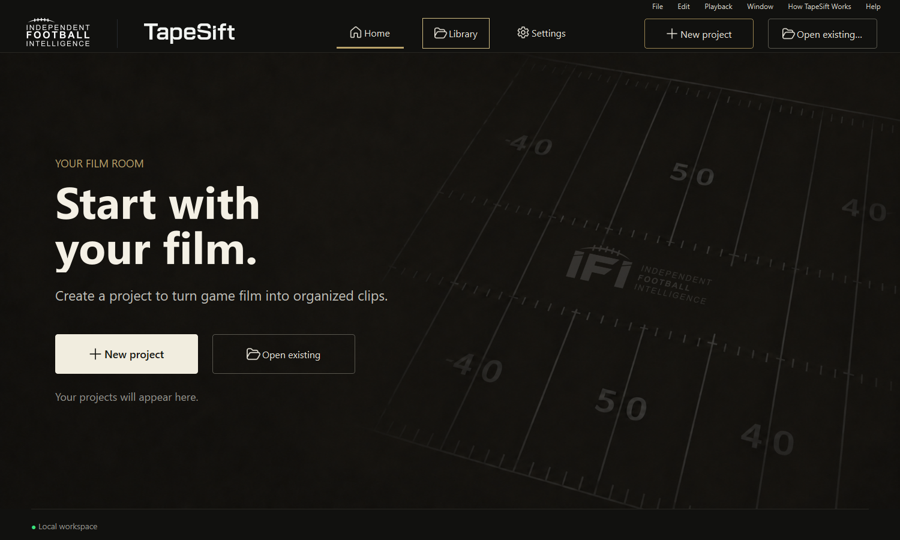

<p align="center">
  
</p>

# TapeSift

Football film review, clip editing, and searchable play breakdowns for Windows and Linux.

**Private development release.** This repository launches the current desktop interface. It contains application code, product assets, synthetic test fixtures, and build tools. Projects, footage, saved preferences, credentials, and development-session history are excluded.



## Work with film

- Open game film, mark clips manually, or review suggested play boundaries.
- Use J/K/L transport, pause and resume, and inspect individual frames.
- Record quarters, situations, play types, results, players, and notes.
- Edit visible Tag Map rows with the keyboard; hidden rows return space to the video.
- Find plays across projects in the Clip Library.
- Export individual clips, reels, player cutups, and field summaries.

Play detection produces suggestions that need review. Editing and detection run locally. **First Read is optional**, disabled by default, and sends selected still-frame contact sheets directly to the configured provider using a supplied API key. See [privacy and security](SECURITY.md).

## Get started

Clone this repository using its GitHub **Code** button URL:

```sh
git clone <repository-url> TapeSift-Desktop
cd TapeSift-Desktop
```

Python 3.12 or newer is required. Dependencies are pinned in `pyproject.toml`.

### Windows

```powershell
py -3.12 -m venv .venv
.\.venv\Scripts\python.exe -m pip install -e .
.\.venv\Scripts\python.exe scripts/fetch_ffmpeg.py
.\.venv\Scripts\python.exe -m tapesift
```

An existing compatible FFmpeg/FFprobe installation on PATH also works. The fetch script downloads the pinned Windows build and verifies its checksum.

### Linux / Omarchy

Install FFmpeg and the Qt runtime libraries using [the Linux setup guide](docs/LINUX.md), then:

```sh
python3 -m venv .venv
.venv/bin/python -m pip install -e .
.venv/bin/python -m tapesift
```

Add TapeSift to the desktop application launcher:

```sh
.venv/bin/python scripts/install_linux_desktop.py
```

`python -m tapesift`, the installed `tapesift` command, `run_tapesift.py`, and `run_tapesift_v3.py` all open the same desktop interface. A fresh install starts with an empty Home page. Open existing `.tapesift` projects to populate the library; source footage remains an external file and may need relinking after moving between computers.

## Keyboard workflow

| Keys | Action |
| --- | --- |
| Space; J / K / L | Play/pause; reverse / stop / forward |
| I / O | Mark the start / end of a clip |
| A | Name or log the marked range |
| W / B | Next / previous clip, saving valid edits |
| E | Focus Clip Details |
| Shift+E; J / K; Enter | Enter Tag Map; move through visible rows; edit the cell |
| Esc | Close the editor, then return to playback |
| Shift+Up / Shift+Down | Zoom the timeline in / out |
| Shift+F; Ctrl+0 | Fit the selected play; show the full timeline |
| Ctrl+B or Ctrl+I | Toggle Clip Details |
| Ctrl+Shift+B | Toggle Clip Ledger |
| Ctrl+Shift+Enter | Save and advance, including from text fields |
| F1 or ? | Open the searchable keyboard guide |

Text fields and popups keep their typing keys. With default detail prompts, O opens the details form. With prompts disabled, press A after I/O to name the clip. The in-app guide explains the alternate prompt modes.

## Development and verification

```sh
python -m pip install -e '.[dev,research]'
python -m pytest tapesift/tests -q -p no:randomly
```

[Testing](docs/TESTING.md) records platform limits and how to reproduce checks. [Architecture](docs/architecture.md) identifies the current interface and shared components. [Release verification](docs/RELEASE.md) records what has actually been tested; target-laptop performance is a separate hardware check.

The Windows executable is a build snapshot. Rebuild it with `python scripts/build_windows.py` after changing source. The source launch commands above always load the current checkout.

## Licensing

TapeSift retains its existing proprietary terms; this private development repository does not grant additional redistribution rights. See [LICENSE.txt](LICENSE.txt). Third-party fonts, icons, Qt/PySide6, Python, and FFmpeg retain their own licenses; see [notices](installer/THIRD_PARTY_NOTICES.txt).
